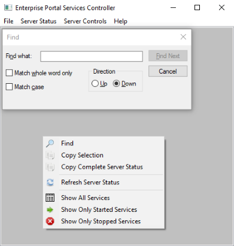

# Portal Services Controller for Esri Enterprise Portal Servers

Portal Services Controller provides a simple, user-friendly interface that allows users to quickly view and control the state of services on an Esri Enterprise Portal Server.


The directory, name, and state of every service on the server can be obtained in just a few seconds via an easy to understand context menu and selectable text control frame.  Users can start or stop all services at once with three clicks via the top menu bar, allowing server maintenance tasks or service modifications to be performed without wasting time clicking stop or start on dozens of services using ArcGIS Server Manager, or typing out a long list of services in JSON format using ArcGIS Server Administrator Directory.  

## Using the Tool

When opened, the tool checks for a ```config.ini``` file in a local ```config``` directory:

    🗃️ Drive:\
    ┣ 📂 Containing Directory
    ┃ ┣ 📁 config 📁
    ┃ ┃ ┗ 📜 config.ini
    ┃ ┗ 💻 Portal Services Controller.exe

 * If not found the tool will generate the ```config``` directory and ```config.ini``` file in it's local directory and prompt the user for an Enterprise Portal URL as well as credentials for the server.  Once entered, the tool applies a light encryption and writes the data to the ```config.ini``` file.  <i>The encryption is merely obfuscation to prevent credentials being stored in plain readable text and should not be considered secure.</i>

     


 * If found, data from ```config.ini``` is decrypted and loaded into memory.  The tool will then attempt to obtain a security token from the server, if successful a quick count of services on the server is gathered and the tool window will open, displaying the Enterprise Portal URL and some basic instructions in the status frame.

     

<br>

### From here, several menu bar options are available:

* ```File``` menu allows you to update Enterprise Portal Credentials or Quit.
* ```Server Status``` menu has options for searching for specific text, copying the selected or entire displayed text, refreshing the server status, and filtering the data by service state.
* ```Server Controls``` menu will spawn a confirmation popup, then send the appropriate command to the server.
* Server and service information are displayed in an interactable text frame, a ```right-click``` in the text frame will open the ```Server Status``` menu as a context menu.

## Image Gallery
|File Menu|Server Status Menu|Server Controls Menu|
|:-:|:-:|:-:|
| ||
|Service Status Display|Find Dialog & Context Menu|Common Popups|
| ||<br><br><br>


## External Libraries

### C++ Requests: Curl for People

&nbsp;&nbsp;&nbsp;&nbsp;*C++ Requests is a simple wrapper around libcurl inspired by the excellent Python Requests project.*
  * [GitHub Repository](https://github.com/libcpr/cpr)

### nlohmann JSON

&nbsp;&nbsp;&nbsp;&nbsp;*JSON for Modern C++*
  * [GitHub Repository](https://github.com/nlohmann/json)

### wxWidgets

&nbsp;&nbsp;&nbsp;&nbsp;*wxWidgets is a C++ library that lets developers create applications for Windows, macOS, Linux and other platforms with a single code base.*
  * [wxWidgets.org](https://wiki.wxwidgets.org/Install)

