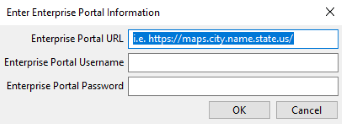
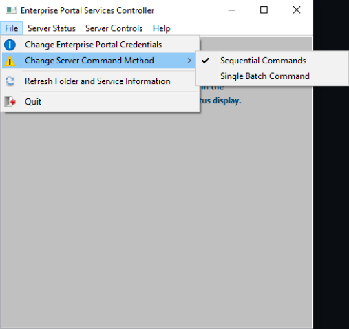
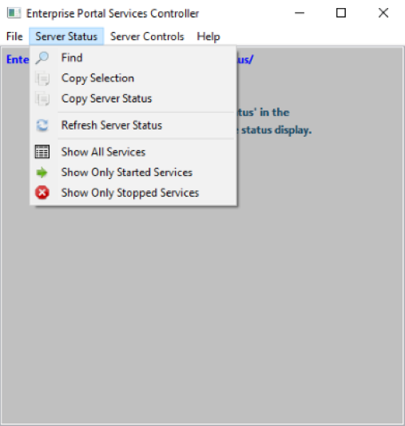
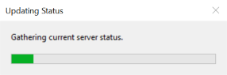
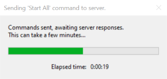

# Portal Services Controller for Esri Enterprise Portal Servers

This application provides a simple, user-friendly interface that allows users to quickly view and control the state of services on an Esri Enterprise Portal Server.


The directory, name, and state of every service on the server can be viewed via an easy to understand context menu and selectable text frame.  Users can start or stop all services at once with a couple clicks of the top menu bar, allowing server maintenance tasks or service modifications to be performed without wasting time clicking stop or start on dozens of services using ArcGIS Server Manager, or manually maintaining a long list of services in JSON format using ArcGIS Server Administrator Directory.

## External Libraries

### C++ Requests: Curl for People

&nbsp;&nbsp;&nbsp;&nbsp;*C++ Requests is a simple wrapper around libcurl inspired by the excellent Python Requests project.*
  * [GitHub Repository](https://github.com/libcpr/cpr)

### nlohmann JSON

&nbsp;&nbsp;&nbsp;&nbsp;*JSON for Modern C++*
  * [GitHub Repository](https://github.com/nlohmann/json)

### wxWidgets

&nbsp;&nbsp;&nbsp;&nbsp;*wxWidgets is a C++ library that lets developers create applications for Windows, macOS, Linux and other platforms with a single code base.*
  * [wxWidgets.org](https://wiki.wxwidgets.org/Install)

## Using the Tool

When opened, the tool checks for a ```config.ini``` file in a local ```config``` directory:

    🗃️ Drive:\
    ┗📂 Containing Directory
      ┣📁 config 📁
      ┃ ┗📜 config.ini
      ┗💻 Portal Services Controller.exe

 * If not found the tool will generate the ```config``` directory and ```config.ini``` file in it's local directory and prompt the user for an Enterprise Portal URL as well as credentials for the server.  Once entered, the tool applies a light encryption and writes the data to the ```config.ini``` file.

     


 * If found, data from ```config.ini``` is decrypted and loaded into memory.  The tool will then attempt to obtain a security token from the server, if successful a quick count of services on the server is gathered and the tool window will open, displaying the Enterprise Portal URL and some basic instructions in the status frame.

     

### From here, several menu bar options are available:

* ```File``` menu allows you to update Enterprise Portal Credentials, Change the Server Command Method, Refresh Folder and Service Information, or Quit.
Services on an Esri Enterprise Portal server can be controlled on two ways:
    1. ```Sequential Commands``` - where each service is individually commanded to start or stop.
    2. ```Single Batch Command``` - where a JSON list of services to start or stop is sent to the server in a single command.

>Testing has shown sequential control to provide signifigantly faster results, but performance may vary depending your hardware configuration.  Experiment with both and find what works best for you.

* ```Server Status``` menu has options for searching the status display, copying the status display, refreshing the server status, and filtering the data by service state.
* ```Server Controls``` menu will spawn a confirmation popup and, if confirmed, send the appropriate command to the server.  You can also generate a JSON list of services to start or stop for use with the ArcGIS Server Administrator Directory.
* Server and service information are displayed in an interactable text frame, a ```right-click``` in the text frame will open the ```Server Status``` menu as a context menu.
* Some features can be accessed via keyboard commands:
    1. ```F5``` will refresh the server status.
    2. ```Ctrl + F``` or ```F3``` will open the find text dialog.
    3. ```Ctrl + A``` will select all the text in the text box.
    4. ```Ctrl + C``` will copy the selected text from the text box.

* ```Help``` menu will display an 'About' window with version information, credits, and a disclaimer.
 
* The tool also saves the server command mode setting, window size, and window position to the ```config.ini``` file on exit.

## Performance Metrics

Tool was tested on an Enterprise Portal Server with an Intel Xeon Gold 5118 CPU, 32GB of memory, and a 500GB hard drive containing 80 services at the time of testing.

Function tests resulted in the following times:
* Update status display - ```~1 second```
* Start Services, Sequential Mode - ```1 minute, 17 seconds```
* Stop Services, Sequential Mode - ```38 seconds```
* Start Services, Batch Mode - ```2 minutes, 6 seconds```
* Stop Services, Batch Mode - ```1 minutes, 45 seconds```

## Image Gallery

|File Menu|Server Status Menu|Server Controls Menu|
|:-:|:-:|:-:|
| ||
|<b>Service Status Display</b>|<b>Find Dialog & Context Menu</b>|<b>Common Popups</b>|
| ||<br><br>
